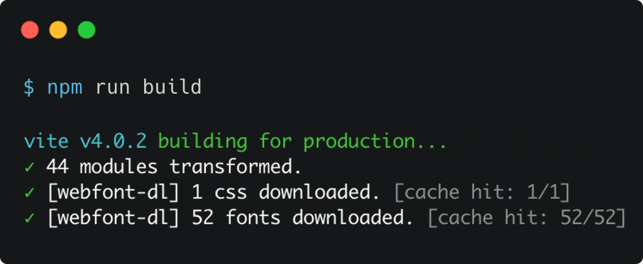
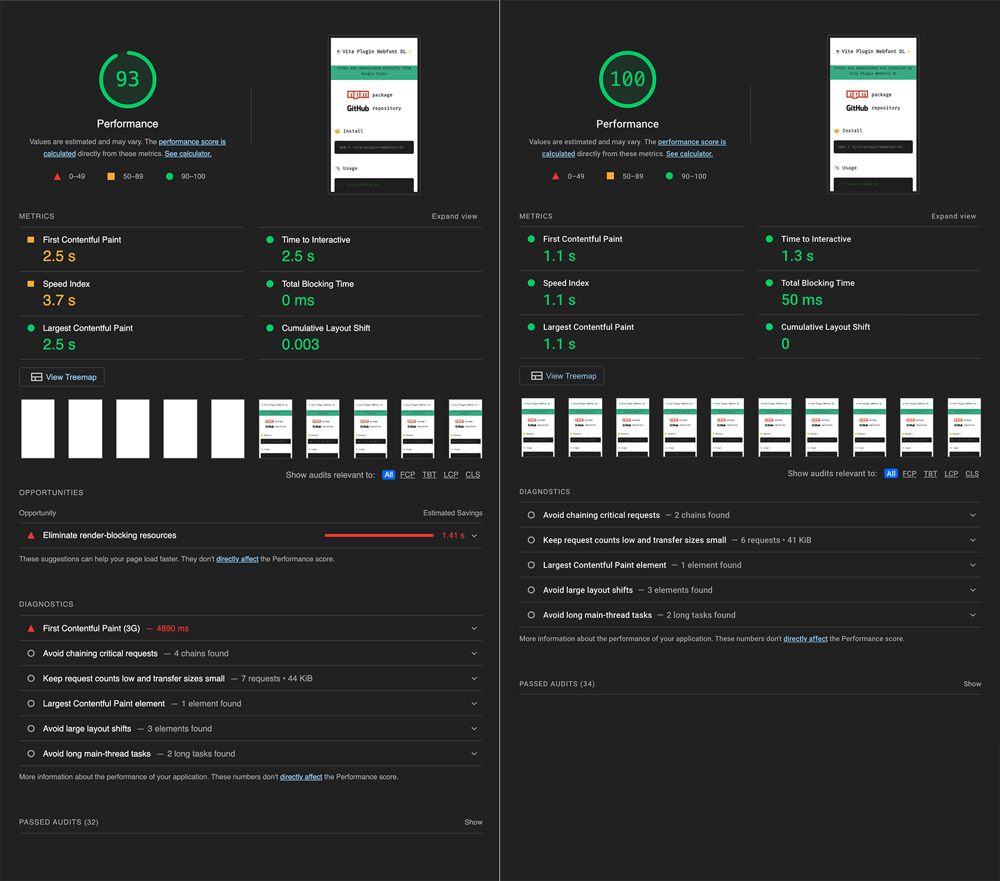

# 🔠 **Webfont Dowload** Vite plugin ⚡

[](https://www.npmjs.com/package/vite-plugin-webfont-dl)
[](https://www.npmjs.com/package/vite-plugin-webfont-dl)

**Collects webfont links, imports and definitions** from your Vite project, **downloads** css and font files ***(privacy-first)***, add the fonts to your **bundle** *(or serves through dev server)*, and **injects** font definitions using a **non-render blocking method**, meanwhile stores external css and font files in a **persistent file cache**, making them available for **offline** development.

<br>

## 📦 Install <span name="install"></span>
```bash
npm i vite-plugin-webfont-dl -D
```

<br>

## 📖 Table of Contents
1. 📦 [Install](#install)
1. Usage:
	* 😎 [Zero config <sub><sup>[method A]</sub></sup>](#zero-config)
	* 🦄 [Simple config <sub><sup>[method B]</sub></sup>](#simple-config)
1. 🚀 [That's all!](#thats-all)
	* 🔌 [Laravel](#laravel)
	* 📸 [Screenshot](#screenshot)
1. 🧩 [Supported webfont providers](#supported-webfont-providers)
1. 🛠️ [Options](#options)
1. ❓ [Third-party webfonts](#third-party-webfonts)
1. 🔮 [How it works](#how-it-works)
	* 📉 [Google Fonts](#google-fonts)
	* 📈 [Webfont-DL Vite plugin](#webfont-dl-vite-plugin)
1. 📊 [Benchmark](#benchmark)
1. 📚 [Resources](#resources)
1. 📄 [License](#license)

<br>

## 😎 Usage: **Zero config** <sub><sup>[method A]</sub></sup> <span name="zero-config"></span>

*Extracts, downloads and injects fonts from the **original Google Fonts code snippet**.*

0. Select your font families in your [webfont provider](#supported-webfont-providers) *(e.g. [Google Fonts](https://fonts.google.com))* and copy the code into `<head>` from the ***"Use on the web"*** block:
	```html
	<link rel="preconnect" href="https://fonts.googleapis.com">
	<link rel="preconnect" href="https://fonts.gstatic.com" crossorigin>
	<link href="https://fonts.googleapis.com/css2?family=Fira+Code:wght@300;400&family=Roboto:wght@100&display=swap" rel="stylesheet">
	```
1. Add **`webfontDownload`** to your Vite plugins without any configuration and the plugin automagically will take care of everything:
	```js
	// vite.config.js

	import webfontDownload from 'vite-plugin-webfont-dl';

	export default {
	  plugins: [
	    webfontDownload(),
	  ],
	};
	```
2. The original webfont tags will be replaced in `dist/index.html`:
	```html
	<style>@font-face{font-family:...;src:url(/assets/foo-xxxxxxxx.woff2) format('woff2'),url(/assets/bar-yyyyyyyy.woff) format('woff')}...</style>
	```

<br>

## 🦄 Usage: **Simple config** <sub><sup>[method B]</sub></sup> <span name="simple-config"></span>

*Extracts, downloads and injects fonts from the **configured webfont CSS URL(s)**.*

0. Select your font families in your [webfont provider](#supported-webfont-providers) *(e.g. [Google Fonts](https://fonts.google.com))* and copy the **CSS URL**(s) from the ***"Use on the web"*** code block:
	```html
	<link href="[CSS URL]" rel="stylesheet">
	```
1. Add **`webfontDownload`** to your Vite plugins with the selected Google Fonts **CSS URL**(s):
	```js
	// vite.config.js

	import webfontDownload from 'vite-plugin-webfont-dl';

	export default {
	  plugins: [
	    webfontDownload([
	      'https://fonts.googleapis.com/css2?family=Press+Start+2P&display=swap',
	      'https://fonts.googleapis.com/css2?family=Fira+Code&display=swap'
	    ]),
	  ],
	};
	```

<br>

## 🚀 That's all! <span name="thats-all"></span>
The webfonts are **injected and ready to use**.<br>
The plugin does its job seamlessly whether you are working on local development server or building to production.

```css
h1 {
  font-family: 'Press Start 2P', cursive;
}

h2 {
  font-family: 'Fira Code', monospace;
}
```

### 🔌 Laravel <span name="laravel"></span>
To make it work with [Laravel Vite Plugin](https://laravel.com/docs/vite) add this line to your blade file:
```blade
@vite('webfonts.css')
```

### 📸 Screenshot <span name="screenshot"></span>


<br>

### 🧩 Supported webfont providers <span name="supported-webfont-providers"></span>
- **[Google Fonts](https://fonts.google.com)**: works with [Zero config](#zero-config) or [Simple config](#simple-config)
- **[Bunny Fonts](https://bunny.net/fonts/)**: works with [Zero config](#zero-config) or [Simple config](#simple-config)
- **[Fontshare](https://www.fontshare.com)**: works with [Zero config](#zero-config) or [Simple config](#simple-config)
- *any provider with CSS (containing `@font-face` definitions) works with [Simple config](#simple-config)*

<br>

### 🛠️ **Options** <span name="options"></span>
- **`injectAsStyleTag`** <small>(`boolean`, default: `true`)</small>:<br>
  Inject webfonts as `<style>` tag (embedded CSS) or as an external `.css` file

- **`minifyCss`** <small>(`boolean`, default: *value of* `build.minify`)</small>:<br>
  Minify CSS code during build.

- **`async`** <small>(`boolean`, default: `true`)</small>:<br>
  Prevent the usage of inline event handlers (`webfonts.css`) that can cause Content Security Policy issues.<br>
  Works only with **`injectAsStyleTag:false`**.

- **`cache`** <small>(`boolean`, default: `true`)</small>:<br>
  Persistently store downloaded css and font files in local file cache.<br>
  If set to `false` the existing cache will be deleted.

- **`proxy`** <small>(`false|AxiosProxyConfig`, default: `false`)</small>:<br>
  [Proxy configuration](https://axios-http.com/docs/req_config) for network requests.

*usage:*

```js
ViteWebfontDownload(
  [],
  {
    injectAsStyleTag: true,
    minifyCss: true,
    async: true,
    cache: true,
    proxy: false,
  }
)
```

*or:*

```js
ViteWebfontDownload(
  [
    'https://fonts.googleapis.com/css2?family=Poppins:wght@300;400;500;600;700&display=swap',
  ],
  {
    injectAsStyleTag: true,
    minifyCss: true,
    async: true,
    cache: true,
    proxy: false,
  }
)
```

<br>

### ❓ Third-party webfonts <span name="third-party-webfonts"></span>

⚠️ Using the standard method to add third-party webfonts ([Google Fonts](https://fonts.google.com), [Bunny Fonts](https://bunny.net/fonts/) or [Fontshare](https://www.fontshare.com)) to a webpage can **slow down page load significantly.** **Lighthouse** and **PageSpeed Insights** calls them ***"render-blocking resource"***, which means the page can't render fully until the webfonts CSS hasn't been fetched from the remote server.

📈 By avoiding render-blocking resources caused by third-party webfonts, you can **boost page performance** which leads to **better user-experience** and it **improves SEO results**.

⚙️ The plugin **downloads the given fonts from the third-party webfont service *(like Google Fonts)* and dynamically injects** them *(as an internal or external stylesheet)* into your Vite project, transforming the third-party webfonts into **self-hosted** ones. 🤩

🔐 In addition to the significant **performance increase**, your visitors will also benefit to **privacy protection**, since there is no third-party server involved.

<br>

## 🔮 How it works <span name="how-it-works"></span>

### 📉 **Google Fonts** <span name="google-fonts"></span>

**Google Fonts** generates the following code which you have to inject into your website's `<head>`, *example*:

```html
<link rel="preconnect" href="https://fonts.googleapis.com">
<link rel="preconnect" href="https://fonts.gstatic.com" crossorigin>
<link href="https://fonts.googleapis.com/css2?family=Fira+Code&display=swap" rel="stylesheet">
```

📱 What happens on **client-side** with **Google Fonts**:
1. First line gives a hint to the browser to begin the connection handshake *(DNS, TCP, TLS)* with `fonts.googleapis.com`. This happens in the background to improve performance. [**`preconnect`**]
1. Second line is another preconnect hint to `fonts.gstatic.com`. [**`preconnect`**]
1. Third line instructs the browser to load and use a CSS stylesheet file from `fonts.googleapis.com` *(with [`font-display:swap`](https://developer.mozilla.org/en-US/docs/Web/CSS/@font-face/font-display#values))*. [**`stylesheet`**]
1. The browser downloads the CSS file and starts to parse it. The parsed CSS is a set of `@font-face` definitions containing font URLs from `fonts.gstatic.com` server.
1. The browser starts to download the all relevant fonts from `fonts.gstatic.com`.
1. After the successful fonts download the browser swaps the fallback fonts to the downloaded ones.

### 🆚

### 📈 **Webfont-DL** Vite plugin <span name="webfont-dl-vite-plugin"></span>

On the contrary, **Webfont-DL plugin** does most of the job at build time, leaves the minimum to the browser.

**Webfont-DL plugin**
- collects the webfont CSS URLs (from plugin config, `index.html` and the generated CSS)
- downloads the webfont CSS file(s)
- extracts the font URLs
- downloads the fonts
- adds the fonts to the bundle
- generates an embedded CSS (`<style>` tag) **or** a webfont / external CSS file
- add them to the bundle and injects the following code into your website's `<head>` using a non-render blocking method, *example*:

```html
<style>
  @font-face {
    font-family: 'Fira Code';
    font-style: normal;
    font-weight: 300;
    font-display: swap;
    src: url(/assets/uU9eCBsR6Z2vfE9aq3bL0fxyUs4tcw4W_GNsJV37Nv7g.9c348768.woff2) format('woff2');
    unicode-range: U+0460-052F, U+1C80-1C88, U+20B4, U+2DE0-2DFF, U+A640-A69F, U+FE2E-FE2F;
  }
  ...
</style>
```
**or** *(using dev server or `injectAsStyleTag: false` option)*

```html
<link rel="preload" as="style" href="/assets/webfonts.b904bd45.css">
<link rel="stylesheet" media="print" onload="this.onload=null;this.removeAttribute('media');" href="/assets/webfonts.b904bd45.css">
```

📱 What happens on **client-side** with **Webfont-DL plugin**:

1. Load fonts from the embedded CSS (`<style>` tag).

**or**

1. First line instructs the browser to prefetch a CSS file for later use as stylesheet. [**`preload`**]
1. Second line instructs the browser to load and use that CSS file as a "`print`" stylesheet *(non-render blocking)*. After loading it promote to "`all`" media type stylesheet (by removing the "`media`" attribute). [**`stylesheet`**]


<br>

## 📊 Benchmark <span name="benchmark"></span>
[Starter Vite project](https://github.com/vitejs/vite/tree/main/packages/create-vite/template-vanilla) with

| [▶️ Standard **Google Fonts**](https://web.dev/measure/?url=https%3A%2F%2Fwebfont.feat.agency%2F) | 🆚 | [▶️ **Webfont DL** Vite plugin](https://web.dev/measure/?url=https%3A%2F%2Fwebfont-dl.feat.agency%2F) |
|:---:|:---:|:---:|
| [🔗 webfont.feat.agency](https://webfont.feat.agency) | | [🔗 webfont-dl.feat.agency](https://webfont-dl.feat.agency) |



<br>

## 📚 Resources <span name="resources"></span>
* [Page Speed Checklist / Fix & Eliminate Render Blocking Resources](https://pagespeedchecklist.com/eliminate-render-blocking-resources)

<br>

## 📄 License <span name="license"></span>

MIT License © 2022 [feat.](https://feat.agency)


