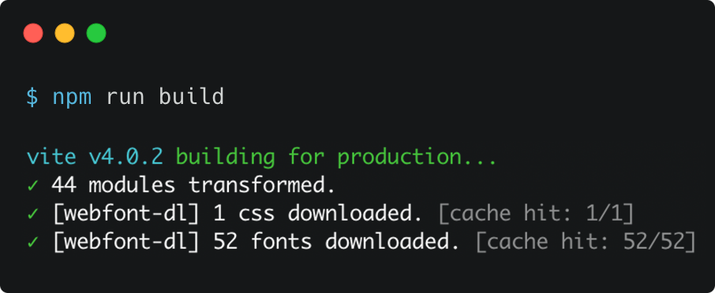
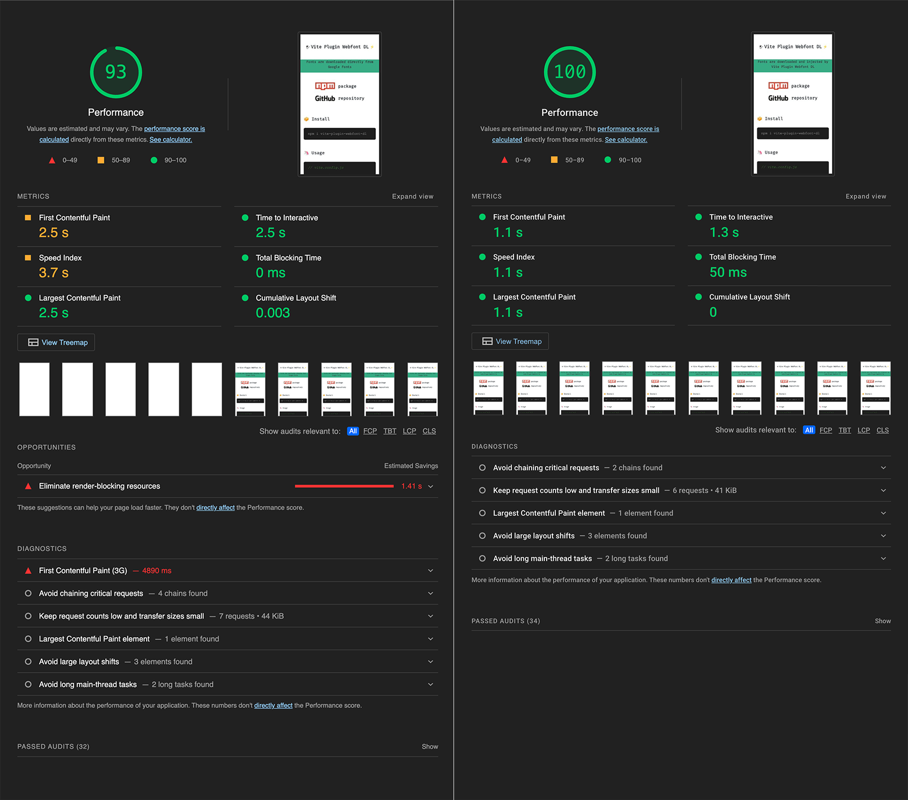

# vite-plugin-webfont-dl

[](https://www.npmjs.com/package/vite-plugin-webfont-dl)
[](https://www.npmjs.com/package/vite-plugin-webfont-dl)
[](https://www.npmjs.com/package/vite-plugin-webfont-dl)
[](#license)

**Webfont Download** — a Vite plugin that downloads webfonts at build time and self-hosts them, eliminating render-blocking requests to third-party font providers.

The plugin collects webfont links, imports, and definitions from your project, downloads the CSS and font files, adds the fonts to your bundle (or serves them through the dev server), and injects the font definitions using a non-render-blocking method.

## Features

- **Zero config** — automatically detects webfont `<link>` tags, plugin config URLs, and CSS `@import` statements
- **Self-hosted fonts** — font files are bundled with your app; no third-party requests at runtime
- **Non-render-blocking** — fonts are injected as an inline `<style>` tag or an asynchronously loaded stylesheet
- **Privacy-first** — visitors never connect to font CDNs, so no user data is exposed to third parties
- **Persistent cache** — downloaded CSS and font files are cached locally, enabling offline development
- **Broad compatibility** — works with Vite 2–8, including the Rolldown-based Vite 8

## Install

```bash
npm i -D vite-plugin-webfont-dl
```

```bash
pnpm add -D vite-plugin-webfont-dl
```

```bash
yarn add -D vite-plugin-webfont-dl
```

## Usage

There are two alternative ways to use the plugin — **choose whichever fits your project**, you don't need both:

- **[Zero config](#method-a-zero-config)** — keep your webfont provider's original `<link>` snippet in your HTML; the plugin detects and replaces it automatically.
- **[Simple config](#method-b-simple-config)** — no `<link>` tags in your HTML; pass the webfont CSS URL(s) directly to the plugin instead.

Both methods lead to the same result: self-hosted, non-render-blocking webfonts — see [That's all!](#thats-all) below.

### Method A: Zero config

Extracts, downloads, and injects fonts from the original code snippet of your webfont provider.

1. Select your font families at your [webfont provider](#supported-webfont-providers) (e.g., [Google Fonts](https://fonts.google.com)) and copy the code from the **"Use on the web"** block into your `<head>`:

   ```html
   <link rel="preconnect" href="https://fonts.googleapis.com">
   <link rel="preconnect" href="https://fonts.gstatic.com" crossorigin>
   <link href="https://fonts.googleapis.com/css2?family=Fira+Code:wght@300;400&family=Roboto:wght@100&display=swap" rel="stylesheet">
   ```

2. Add `webfontDownload` to your Vite plugins without any configuration:

   ```js
   // vite.config.js
   import webfontDownload from 'vite-plugin-webfont-dl';

   export default {
     plugins: [
       webfontDownload(),
     ],
   };
   ```

3. The original webfont tags are replaced with self-hosted font definitions in `dist/index.html`:

   ```html
   <style>@font-face{font-family:...;src:url(/assets/foo-xxxxxxxx.woff2) format('woff2'),url(/assets/bar-yyyyyyyy.woff) format('woff')}...</style>
   ```

### Method B: Simple config

Extracts, downloads, and injects fonts from the configured webfont CSS URL(s).

1. Select your font families at your [webfont provider](#supported-webfont-providers) and copy the **CSS URL(s)** from the **"Use on the web"** code block:

   ```html
   <link href="[CSS URL]" rel="stylesheet">
   ```

2. Pass the CSS URL(s) to the plugin:

   ```js
   // vite.config.js
   import webfontDownload from 'vite-plugin-webfont-dl';

   export default {
     plugins: [
       webfontDownload([
         'https://fonts.googleapis.com/css2?family=Press+Start+2P&display=swap',
         'https://fonts.googleapis.com/css2?family=Fira+Code&display=swap',
       ]),
     ],
   };
   ```

### That's all!

Whichever method you chose, the result is the same: the webfonts are downloaded, self-hosted, and injected — ready to use on both the local development server and in production builds:

```css
h1 {
  font-family: 'Press Start 2P', cursive;
}

h2 {
  font-family: 'Fira Code', monospace;
}
```

> **Import alias:** the plugin can be imported under any of these names: `webfontDownload`, `webfontDl`, `viteWebfontDl`, `ViteWebfontDownload`, or `viteWebfontDownload`.



### Laravel

To use with the [Laravel Vite Plugin](https://laravel.com/docs/vite), add this line to your Blade file:

```blade
@vite('webfonts.css')
```

## Supported webfont providers

All of the following work with both [zero config](#method-a-zero-config) and [simple config](#method-b-simple-config):

- [Google Fonts](https://fonts.google.com)
- [Bunny Fonts](https://bunny.net/fonts/)
- [Fontshare](https://www.fontshare.com)
- [Fira Code](https://github.com/tonsky/FiraCode) and [Hack](https://github.com/source-foundry/Hack) fonts (`cdn.jsdelivr.net`)
- [Inter](https://rsms.me/inter/) font (`rsms.me`)

Additionally, any provider whose CSS contains `@font-face` definitions works with [simple config](#method-b-simple-config).

## Options

| Option | Type | Default | Description |
|---|---|---|---|
| `injectAsStyleTag` | `boolean` | `true` | Inject the webfont CSS inline as a `<style>` tag. Set to `false` to emit an external `.css` file instead. |
| `async` | `boolean` | `true` | Load the external stylesheet asynchronously (non-render-blocking). Only applies when `injectAsStyleTag` is `false`. |
| `minifyCss` | `boolean` | value of `build.minify` | Minify the generated CSS during build. |
| `embedFonts` | `boolean` | `false` | Embed fonts into the CSS as base64 data URIs instead of emitting separate font files. |
| `assetsSubfolder` | `string` | `''` | Place downloaded font files in a subfolder of the assets directory. |
| `cache` | `boolean` | `true` | Persistently cache downloaded CSS and font files (respects Vite's [`cacheDir`](https://vite.dev/config/shared-options#cachedir)). Set to `false` to disable caching and delete an existing cache. |
| `subsetsAllowed` | `string[]` | `[]` | Only download the listed subsets (e.g. `['latin', 'latin-ext']`). An empty array allows all subsets. |
| `proxy` | `false \| AxiosProxyConfig` | `false` | [Proxy configuration](https://axios-http.com/docs/req_config) for network requests. |
| `throwError` | `boolean` | `false` | Stop the build when a font fails to download or process. When `false`, errors are logged as warnings and the build continues. |

> **Content Security Policy:** the async loading technique uses an inline `onload` handler, which strict CSP environments (e.g. Chrome extensions) prohibit. In those environments, keep the default `injectAsStyleTag: true`, or set `async: false` for standard blocking CSS loading.

> **Note:** `embedFonts` can increase the output size if the CSS references the same font file multiple times ([example](https://fonts.googleapis.com/css2?family=Roboto+Condensed:wght@400;700&display=swap&text=0123456789)).

### Example configuration

```js
// vite.config.js
import webfontDownload from 'vite-plugin-webfont-dl';

export default {
  plugins: [
    webfontDownload([], {
      injectAsStyleTag: true,
      minifyCss: true,
      embedFonts: false,
      async: true,
      cache: true,
      proxy: false,
      assetsSubfolder: 'fonts',
      subsetsAllowed: ['latin', 'latin-ext'],
      throwError: false,
    }),
  ],
};
```

With webfont CSS URLs:

```js
webfontDownload([
  'https://fonts.googleapis.com/css2?family=Poppins:wght@300;400;500;600;700&display=swap',
], {
  injectAsStyleTag: true,
  cache: true,
})
```

## Why self-host webfonts?

Adding third-party webfonts ([Google Fonts](https://fonts.google.com), [Bunny Fonts](https://bunny.net/fonts/), or [Fontshare](https://www.fontshare.com)) the standard way can significantly slow down page load. Lighthouse and PageSpeed Insights flag the external stylesheets as *render-blocking resources*: the page can't fully render until the webfont CSS has been fetched from the remote server.

This plugin downloads the fonts at build time and injects them into your project as an internal or external stylesheet, turning third-party webfonts into self-hosted ones. Eliminating the render-blocking requests improves page performance, user experience, and SEO — and since no third-party server is involved, your visitors' privacy is protected as well.

## How it works

### Standard Google Fonts

Google Fonts generates a code snippet that you inject into your website's `<head>` (example):

```html
<link rel="preconnect" href="https://fonts.googleapis.com">
<link rel="preconnect" href="https://fonts.gstatic.com" crossorigin>
<link href="https://fonts.googleapis.com/css2?family=Fira+Code&display=swap" rel="stylesheet">
```

What happens on the client side:

1. The first line hints the browser to begin the connection handshake (DNS, TCP, TLS) with `fonts.googleapis.com` in the background. [`preconnect`]
2. The second line is another preconnect hint, for `fonts.gstatic.com`. [`preconnect`]
3. The third line instructs the browser to load and use a CSS stylesheet from `fonts.googleapis.com` (with [`font-display: swap`](https://developer.mozilla.org/en-US/docs/Web/CSS/@font-face/font-display#values)). [`stylesheet`]
4. The browser downloads and parses the CSS: a set of `@font-face` definitions with font URLs pointing at `fonts.gstatic.com`.
5. The browser downloads all relevant fonts from `fonts.gstatic.com`.
6. Once the fonts are downloaded, the browser swaps the fallback fonts for the webfonts.

### With vite-plugin-webfont-dl

The plugin does most of this work at build time, leaving minimal work for the browser. It:

- Collects the webfont CSS URLs (from plugin config, `index.html`, and generated CSS)
- Downloads the webfont CSS file(s)
- Extracts the font URLs
- Downloads the font files and adds them to the bundle
- Generates embedded CSS (`<style>` tag) **or** an external webfont CSS file
- Injects the result into your website's `<head>` using a non-render-blocking method (example):

```html
<style>
  @font-face {
    font-family: 'Fira Code';
    font-style: normal;
    font-weight: 300;
    font-display: swap;
    src: url(/assets/uU9eCBsR6Z2vfE9aq3bL0fxyUs4tcw4W_GNsJV37Nv7g.9c348768.woff2) format('woff2');
    unicode-range: U+0460-052F, U+1C80-1C88, U+20B4, U+2DE0-2DFF, U+A640-A69F, U+FE2E-FE2F;
  }
  ...
</style>
```

**Or**, when using the dev server or the `injectAsStyleTag: false` option:

```html
<link rel="preload" as="style" href="/assets/webfonts.b904bd45.css">
<link rel="stylesheet" media="print" onload="this.onload=null;this.removeAttribute('media');" href="/assets/webfonts.b904bd45.css">
```

What happens on the client side:

1. Fonts load directly from the embedded CSS (`<style>` tag). **Or:**
1. The first line instructs the browser to prefetch the CSS file for later use as a stylesheet. [`preload`]
2. The second line loads the CSS file as a `print` stylesheet (non-render-blocking), then promotes it to an `all` media stylesheet once loaded, by removing the `media` attribute. [`stylesheet`]

## Benchmark

Comparison using a [starter Vite project](https://github.com/vitejs/vite/tree/main/packages/create-vite/template-vanilla):

| Standard Google Fonts | vite-plugin-webfont-dl |
|:---:|:---:|
| [webfont.feat.agency](https://webfont.feat.agency) | [webfont-dl.feat.agency](https://webfont-dl.feat.agency) |
| [PageSpeed Insights](https://pagespeed.web.dev/analysis?url=https%3A%2F%2Fwebfont.feat.agency%2F) | [PageSpeed Insights](https://pagespeed.web.dev/analysis?url=https%3A%2F%2Fwebfont-dl.feat.agency%2F) |



## Resources

- [Page Speed Checklist / Fix & Eliminate Render Blocking Resources](https://pagespeedchecklist.com/eliminate-render-blocking-resources)

## License

MIT License © 2022–present [feat.](https://feat.agency)
